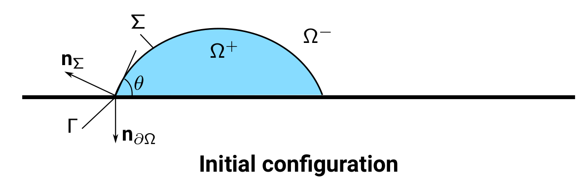
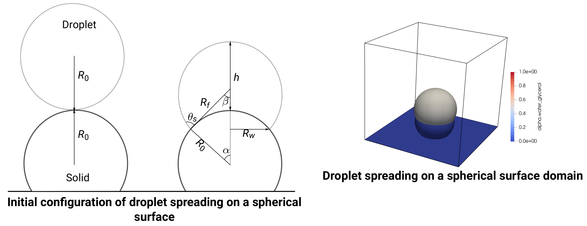
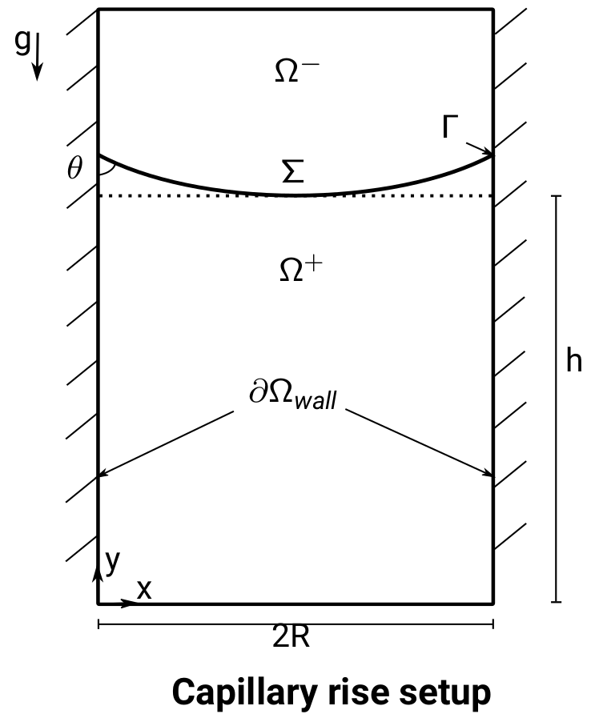

# Benchmark suite

The benchmark suite provides four verification and validation studies of a numerical method for wetting.

## Test Cases

### 1. [Interface Advection Test](./Interface Advection Test) 



In this verification study, we consider the advection of the interface using a divergence-free velocity field and report the accuracy of the interface advection near walls. It has been shown in [Fricke et al.](https://doi.org/10.1016/j.physd.2019.01.008) that the contact line advection problem is a well-posed initial value problem if the velocity field is sufficiently regular and tangential to the domain boundary. The interface's motion and the contact angle's evolution can be computed from the velocity field and the initial geometry. Moreover, [Fricke et al.](https://doi.org/10.1016/j.jcp.2019.109221) formulated an ODE system to describe the evolution of the contact angle $\theta$. 
Numerical contact angle is calculated by the interface normal $\textbf{n}_{\Sigma}$ and patch face normal $\textbf{n}_{\partial\Omega}$ as, 

$\theta = \cos^{-1}(\langle - \textbf{n}_{\Sigma}(t, \textbf{x}(t)), \textbf{n}_{\partial\Omega}\rangle).$ 

The test case is carried out for a uniform and non-uniform graded 2D cartesian mesh.


### 2. [Droplet Spreading over a flat surface](./DropletSpreadingTest) 


For this case study, we have considered a droplet spreading on a flat surface ([Dupont and Legendre](https://doi.org/10.1016/j.jcp.2009.07.034) ,  [Fricke et. al](https://doi.org/10.48550/arXiv.2003.04914)) that allows for studying the effect of the static contact angle boundary condition and the Bond number, $Bo = \frac{\rho_l g R_0}{\sigma}$ on the equilibrium shape of the droplet. Ideally, surface tension forces dominate for a droplet that spreads with $Bo\ll1$, and the droplet at equilibrium maintains a spherical cap shape and satisfies the contact angle boundary condition. On the other hand, for $Bo\gg1$, the gravitational forces dominate, and the droplet forms a puddle, whose height is directly proportional to the capillary length, $l_{Ca}=\sqrt{\frac{\sigma}{\rho_l g}}$. The conservation of the droplet's volume $V$ with an equilibrium contact angle $\theta_e$ allows formulation of the geometrical relations that define the equilibrium shape of the droplet. In addition to observing droplets at equilibrium, we have also studied the mesh convergence of the spreading droplets.


### 3. [Droplet Spreading over a spherical surface](./SphericalSpreadingTest)


In this study, we consider a droplet spreading over a spherical surface for a very small Bond number ($Bo\ll1$), as described by [Patel et. al](https://doi.org/10.1016/j.ces.2017.03.012). This case study allows studying the spreading of a droplet over a complex surface discretized using an unstructured Cartesian three-dimensional mesh refined locally around the spherical object. We compare the droplet geometrical charactersitics (contact radius $r$) and height ($e$) at the equilibrium.

### 4. [2D Capillary Rise](./2DCapillaryRiseTest)


In this validation study, we consider the rising of a liquid column between two planar surfaces. We present the results of the mesh convergence study of a 2D capillary rise with no-slip and resolved partial slip boundary condition. We present the comparison of the plicRDF-isoAdvector method with other numerical methods, 1. the OpenFOAM solver interTrackFoam, an Arbitrary Lagrangian-Eulerian (ALE) method, 2. the Free Surface 3D (FS3D), an in-house two-phase flow solver implying the geometric Volume-of-Fluid (VOF) method, 3. the OpenFOAM-based algebraic VOF solver, interFoam, 4. the Bounded Support Spectral Solver (BoSSS) is based on the extended discontinuous Galerkin method. As discussed by [Gründing et. al](https://doi.org/10.1016/j.apm.2020.04.020), the dynamics of capillary rise can be controlled by a non-dimensionless group, $\Omega$, defined as

$\Omega = \sqrt{\frac{9\sigma\cos\theta \mu^2}{\rho^3g^2R^5}}$

## Installation
Following instructions will get a copy of the benchmark suite up and running on a local/remote machine.
The current study is based on the Volume-of-Fluid method based OpenFOAM's solver `interFlow`. The available Jupyter notebooks used for post-processing and visualization can be used by an OpenFOAM user and any other simulation software user, provided the files storing the secondary data (error norms) are organized as described in the README.md file.   

### Compilation & Installation dependencies

Compiler:  g++ (GCC) 9.2.0\
Build system: CMake version 3.19.3
  
### Computing dependencies

Meshing

- [gmsh](http://gmsh.info/) meshing software version 4.4.1, used for generating surface meshes.
- [cfmesh](https://develop.openfoam.com/Community/integration-cfmesh/-/tree/v2112), available as an OpenFOAM (git tag, OpenFOAM-v2112) sub-module, used for automatic generation of unstructured volume meshes.

OpenFOAM

To install OpenFOAM from the GitLab repository, follow the [instructions](https://develop.openfoam.com/Development/openfoam) 

- Clone the OpenFOAM repository using git.
- Check out the git tag
```
    ?> git checkout OpenFOAM-v2112
```
- Compile OpenFOAM as instructed by its documentation.

TwoPhaseFlow Library

To link the TwoPhaseFlow library, follow the instructions in [README.md](https://github.com/DLR-RY/TwoPhaseFlow/tree/of2112#readme) of the library,

- Clone the TwoPhaseFlow library using git.
- Check out the git tag
```
    ?> git checkout of2112
```
- Compile the library as instructed by its documentation.

### Case initialization dependencies

[argo](https://gitlab.com/leia-methods/argo/-/tree/master)\
To compute the volume fractions for initialization using the Surface-Mesh/Cell Approximation Algorithm, SMCA, using
exact implicit surfaces.

[FreeCAD](https://www.freecadweb.org/) - version 0.18.4\
To generate `.stl` files as input domain geometry (not required to run case studies).

[PyFoam](https://openfoamwiki.net/index.php/Contrib/PyFoam) - version 2021.6\
To set up parametric studies for verification and validation of the numerical method.

### Post-processing dependencies

We use OpenFOAM Function Objects to create the data in a `*.csv |*.vtk | *.vtp` file format that is read by [Jupyter notebooks](https://jupyter.org/) for visualization and processing of test results.


## How to setup and run the case studies

Currently, each case study contains executable script and Python modules to setup and execute parametric studies and visualize the results in Jupyter notebooks.

### How to use the wetting test cases

Use the scripts `reproduce_<test_case>.sh` with `-h` to get further information about the script and the options required to run the case study.

**Example**

- Go to a test case folder, e.g., `AdvectionTest/UniformMesh`:
```
?> cd AdvectionTest/UniformMesh
```
- Run `reproduce_AdvectionTest_UniformMesh.sh` script that executes 
    - `./create-study.py case case.paramter` to create the case directories of a parametric study
    - `./Allclean` to clean the case directories
    - `./Allrun` to create the mesh and initialize fields in each case directories
    - the solver (local/remote job submission) in each case directory

- The data has been written to a `*.csv |*.vtk | *.vtp` file in the `postProcessing/` directory of each case directory.

- The Jupyter notebooks access `postProcessing/` files to visualize and process test results. 

#### Templated case structure

All the test cases within this benchmark suite are templated so that the parametric studies can be created from them. So, inside each case study directory following files and directories are present, e.g., `AdvectionTest/UniformMesh`:
- the templated case, namely `case`,
- a parameter file, namely `case.parameter`,
- template files with extension `.template`.

The template files contain placeholders for the parameters, e.g., `@!meshSize!@` for the mesh cell size. These placeholders are replaced by the values from the `case.parameter` file during the parametric study creation (`./create-study.py case case.paramter`).

Additionally, all test case directories contain `variation_file` that contains the information of the variants and their parameter vectors obtained by executing the following:
 ```
?> pyFoamRunParamaterVariation.py --list-variations case case.paramter
```
With this information, the user can also identify the case parametric directory corresponding to a specific parameter vector.  

#### Mesh generation and initialization

`./Allrun` script take care of mesh generation and field initialization. It

- generates mesh using OpenFOAM's `blockMesh` utility  or `cartesianMesh` from cfMesh. 
- initializes the fields, e.g., volume fraction using the `setAlphaFieldDict` or the `vofInitDict` dictionary that used the SMCA initialization algorithm from argo.
- decomposes the domain (if required)

#### Running a case study

The script `reproduce_AdvectionTest_UniformMesh.sh` executes the solver in all the parametric case directories. If running all parameter cases is not required, the command to run all variations should be omitted prior to executing the script. 
Each case study can be executed in parallel using `mpirun` with `-np`, providing the number of MPI processes.

#### Executing applications with SLURM

The script, namely `script.sh` in each case directory, supports the submission to the SLURM workload manager using the `sbatch` command. This job submission command is also executed within `reproduce_AdvectionTest_UniformMesh.sh`, so the user must choose the appropriate command before executing the `reproduce_AdvectionTest_UniformMesh.sh` script.

## Post-processing

### Function Objects (FO)

Functions objects are used to write the data to a `*.csv |*.vtk | *.vtp` file format in each case directory's `postProcessing\` folder. The benchmark suite uses the following function objects:

| FO  | Description |
| ------ | ------ |
| `wettedArea` | Recovers the volume fraction value of the boundary face and returns the area of the domain boundary submerged in the transported fluid also referred as wetted area |
| `contactAngle2DEvaluation` | Returns the contact angle field for a 2D geometry |
| `myVortex2D` | Provides the prescribed velocity field 'vortex-in-a-box' |
| `contactAngleEvaluationTest` | Returns the contact angle field and the contact radius for a 3D geometry |

| FO  | Cases | Data Files |
| ------ | ------ | ------ |
| `wettedArea` | DropletSpreadingTest and SphericalSpreadingTest | `wettedArea.csv` |
| `contactAngle2DEvaluation` | AdvectionTest | `contactAngleMax.csv` , `contactAngleMin.csv` |
| `myVortex2D` | AdvectionTest |
| `contactAngleEvaluationTest` | DropletSpreadingTest and SphericalSpreadingTest | `contactAngleMax.csv` , `contactAngleMin.csv` , `rfMax.csv` |

### Data file format
The following file formats are used in this benchmark suite:

| File format | Description |
| ------ | ------ |
| `*.csv` format | It contains the data from the function objects, e.g., the `wettedArea` function object provides a `wettedArea.csv` file. |
| `*.vtk` format  | These are the surface files in ASCII format that contain the fields' information at every `writeControl` time (time of writing the output data) of your simulation setup. These files are read to calculate the height of the interface, e.g., droplet spreading case study. |
|`*.vtp` format | Used to visualize the Piecewise Linear Interface inside the cell. |
 
**Example**

For the `AdvectionTest/UniformMesh` case study, the `postProcessing/` directory has the following files and directories:

1. `contactAngleMax.csv` (The maximum contact angle in the domain)
2. `contactAngleMin.csv` (The minimum contact angle in the domain) 
3. `plic/` (It contains `*.vtp` files at each `writeControl` time of the simulation)
4. `surfaces/` (It contains `*.vtk` files at each `writeControl` time of the simulation)

**Note** for geometrical shape error,

$E_1 = \sum_{c} |\alpha_{c}(\tau) - \alpha_{c}(0)|V_c,$

the volume fraction $\alpha_{c}(0)$ at $t=0$ and $\alpha_{c}(\tau)$ at $t=\tau$ is also required.

### Data file structure

We will show the structure of the `*.csv` files for every function object.

- `contactAngle2DEvaluation`

| Time (sec) | contact angle (degree) |
| ------ | ------ |
| 0.01 | 57.1 |
| 0.02 | 58.2 |

- `wettedArea`

| Time (sec) | wetted area ($mm^2$) |
| ------ | ------ |
| 0.001 | 4.31 |
| 0.002 | 6.23 |

- `contactAngleEvaluationTest`

| Time (sec) | contact radius (m) |
| ------ | ------ |
| 0.01 | 0.0025 |
| 0.02 | 0.0027 |

The contact radius is the distance from the drop's center to the contact line.

The `surface/` files are read by the Jupyter notebooks and provide the height of the interface in **`height.csv`** file, whose structure is

| Time (sec) | height (m) |
| ------ | ------ |
| 0.01 | 0.0025 |
| 0.02 | 0.0027 | 

The Jupyter notebooks read the above file formats and visualize the case results. The notebooks are generated generically so that any simulation software user can readily use these notebooks, provided he generates the data in the mentioned file format and structure. 

